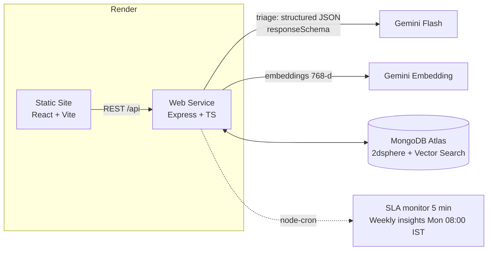

# CivicPulse — Smart Complaint Triage for Chennai

> **HN-AI-02 · Smart Complaint Triage for Civic Bodies** · Built with **Gemini**, **MongoDB Atlas** and **Render**

Citizens report civic problems the way they actually talk: typed English, Tamil (தமிழ்), Hindi, **Tanglish**, a photo, or a voice note. **Gemini triages each one in about 2 seconds.** It detects the language, translates, picks the category and department, assigns a 1–5 priority with a reason, writes a 20-word summary, flags spam and sets an SLA.

**Duplicate reports of the same pothole merge into one Issue.** A merge requires semantic similarity above 0.85, a distance under 300 m and the same category. Officers then see one work item with a report count instead of 40 tickets. The fifth report on an issue escalates its priority automatically.

Officers work a department queue with a live map, SLA countdowns and breach alerts, and can override any AI decision; every override is audit-logged. Admins get city analytics and **AI-written weekly insights**.

---

## Features

| Citizen (mobile-first, EN / தமிழ் toggle) | Officer (desktop) | Admin |
|---|---|---|
| Text + photo + 60 s voice note | Department-scoped priority queue | KPI dashboard (7 / 30 / 90 days) |
| Map pin + "use my location" + reverse geocoding | Live map: colour = priority, size = report count | Complaints vs. resolutions trend |
| Instant AI result: department, priority, SLA, summary | SLA states: on track / at risk / breached + alert banner | SLA compliance per department |
| "Others reported this too" merge notice | Issue detail: every merged report, original language + translation, photo, audio, transcript | AI quality: confidence, override rate, fallback rate |
| Tracking code + status timeline | Start / resolve / close with notes | Language and priority mix, complaint hotspot map |
| Recent reports remembered on device | **Override** category / department / priority, with a required reason, locked against later AI changes | **Gemini weekly insights**: headline, highlights, hotspots, recommendations |

**Resilience built in:**
- All AI output is validated with zod and retried once. If it still fails, triage falls back to `Other` / P3 and the issue is flagged "Needs review", so the app never crashes.
- If Gemini rejects an unsupported audio codec, triage retries with the text and photo only.
- Embeddings fall back to a local hashed vector, so duplicate merging works even with no API key.
- Duplicate search tries Atlas Vector Search first, then a `2dsphere` radius query with in-code cosine similarity. It works with or without the Atlas index.
- Photos and voice notes are stored in MongoDB, not on disk, because Render's filesystem is ephemeral.
- Rate limits apply to complaint submission, login and insight generation.

---

## Architecture



**Complaint pipeline** (`server/src/services/complaint.service.ts`):

1. Store the photo and audio in Mongo.
2. **Triage** with Gemini (multimodal: text, image and audio in one call; structured output via `responseSchema`). Validate with zod, retry once, fall back if needed. The department comes from our own category map, not from the model. The SLA is clamped to policy (0.5×–1.5×).
3. Spam is stored for audit but never enters a queue.
4. **Embed** `summary + English translation`. Translating first lets Tamil, Hindi and Tanglish reports of the same problem match each other.
5. **Duplicate search:** `$vectorSearch` (filtered by category, active status and embedding model), then haversine distance ≤ 300 m and cosine > 0.85. If nothing matches, run a `$geoWithin` radius query, then cosine in code.
6. **Merge** into the existing Issue: increment `reportCount`, escalate priority if the new report is more severe, apply community escalation at 5 reports, and tighten the SLA. Otherwise, create a new Issue.

| Priority | Meaning | Default SLA |
|---|---|---|
| 5 | Danger to life (live wire, open manhole, flooding) | 4 h |
| 4 | Health/safety risk to many | 24 h |
| 3 | Significant inconvenience | 72 h |
| 2 | Minor | 7 days |
| 1 | Cosmetic / suggestion | 14 days |

---

## Run locally

Requires Node 20+.

```bash
npm run install:all
```

### Option A: zero setup (no Atlas, no key)
```bash
npm run dev:demo
```
This starts an **in-memory MongoDB**, seeds 57 demo complaints, and runs the API on :5000 and the web app on http://localhost:5173. Without `GEMINI_API_KEY`, new complaints use the fallback triage. Add the key to `server/.env` to see the real AI.

### Option B: real stack
```bash
cp server/.env.example server/.env   # fill MONGODB_URI, GEMINI_API_KEY, JWT_SECRET
npm run seed                          # wipes + loads demo data, creates the Atlas vector index
npm run dev
```
`npm run seed -- --live` sends every seed complaint through Gemini instead of using the precomputed triage.

### Demo accounts
| Role | Email | Password |
|---|---|---|
| Admin | `admin@civicpulse.in` | `Admin@123` |
| Officers | `roads@`, `swm@`, `water@`, `drains@`, `electrical@`, `health@`, `townplanning@`, `environment@`, `parks@`, `general@` + `civicpulse.in` | `Officer@123` |

The login page also has one-click demo buttons.

### Environment (`server/.env`)
| Variable | Required | Notes |
|---|---|---|
| `MONGODB_URI` | ✅ | Atlas connection string including `/civicpulse` database name |
| `GEMINI_API_KEY` | ✅ for AI | https://aistudio.google.com/apikey |
| `JWT_SECRET` | ✅ in prod | long random string |
| `GEMINI_MODEL` | | default `gemini-flash-latest` |
| `GEMINI_EMBEDDING_MODEL` | | default `gemini-embedding-001` (768-d) |
| `CLIENT_ORIGIN` | prod | allowed CORS origin(s), comma-separated |
| `ATLAS_VECTOR_INDEX` | | default `complaint_embedding_index` |
| `DUPLICATE_SIMILARITY_THRESHOLD` / `DUPLICATE_RADIUS_METERS` | | `0.85` / `300` |

Client: `VITE_API_BASE_URL` stays empty locally (Vite proxies `/api`). On Render, set it to the API URL.

---

## Deploy to Render

1. Push this repo to GitHub.
2. **MongoDB Atlas:** create a free M0 cluster and a database user. Under **Network Access**, allow `0.0.0.0/0` (Render IPs are dynamic).
3. **Render → New → Blueprint →** select the repo. `render.yaml` creates:
   - `civicpulse-api` (Web Service, health check `/api/health`)
   - `civicpulse` (Static Site with SPA rewrite)
4. Fill the prompted secrets: `MONGODB_URI`, `GEMINI_API_KEY`, `CLIENT_ORIGIN` = static site URL, `VITE_API_BASE_URL` = API URL. Then redeploy the static site so the URL is baked into the build.
5. Seed Atlas from your machine: `npm run seed`. This also creates the vector index. To create it by hand, use [`server/atlas/vector-index.json`](server/atlas/vector-index.json) in Atlas → Search → Create Vector Search Index (JSON editor) on the `issues` collection.

> Render's free web services sleep after 15 minutes idle; the first request then takes ~50 s. Open `/api/health` a minute before you demo.

---

## API

| Method | Path | Auth | Purpose |
|---|---|---|---|
| GET | `/api/health` | – | uptime, DB state, Gemini config |
| GET | `/api/meta` | – | categories, departments, rubric |
| GET | `/api/public/stats` | – | landing-page counters |
| POST | `/api/complaints` | – | multipart: `text`, `lat`, `lng`, `address?`, `name?`, `phone?`, `photo?`, `audio?` |
| GET | `/api/complaints/track/:code` | – | citizen tracking |
| GET | `/api/media/:id` | – | photo / audio |
| POST | `/api/auth/login` | – | JWT |
| GET | `/api/issues` | officer/admin | queue (`status, department*, category, priority, sla, q, sort`) |
| GET | `/api/issues/summary` | officer/admin | queue counters |
| GET / PATCH | `/api/issues/:id` | officer/admin | detail; status, notes, overrides (reason required) |
| GET | `/api/analytics?days=30` | admin | dashboard data |
| GET / POST | `/api/insights/latest`, `/api/insights/generate` | admin | weekly AI insights |

\* Officers are always scoped to their own department on the server.

---

## 3-minute demo script

1. **Citizen (phone width):** Toggle **தமிழ்**. Report in Tanglish: *"Anna Nagar 2nd avenue la periya pallam, bike la vizhunthutten"* and attach a photo. The result screen shows the language detected as Tanglish, an English summary, **Roads**, P4 with its reason, and a 24 h SLA.
2. **Duplicates:** Report the same problem again in English about 50 m away. The result says *"Others reported this too"* and the Issue shows 2 reports. Also show the **T Nagar garbage** issue: 5 reports in 4 languages, auto-escalated P3 → P4.
3. **Officer (`roads@`):** Point out the queue, the map and the SLA breach banner. Open an issue to show the merged reports with similarity %, then **Override** priority with a reason and point at the audit log. Click **Start work**, then **Resolve**.
4. **Citizen tracking:** Open the tracking code. The timeline updates.
5. **Admin:** Show the KPIs (dedup rate, SLA compliance, AI accepted-as-is rate), then click **Regenerate** on the weekly insights to show Gemini writing the commissioner's brief.

---

## Project layout

```
client/   React 19 · Vite · TypeScript · Tailwind v4 · shadcn/ui · React Router · react-leaflet · Recharts · framer-motion
server/   Node · Express 5 · TypeScript · Mongoose · @google/genai · zod · multer · jsonwebtoken · node-cron
  src/routes → controllers → services → models
  src/scripts  seed data, seed CLI, in-memory demo mode
render.yaml  Render Blueprint (API web service + static site)
```
