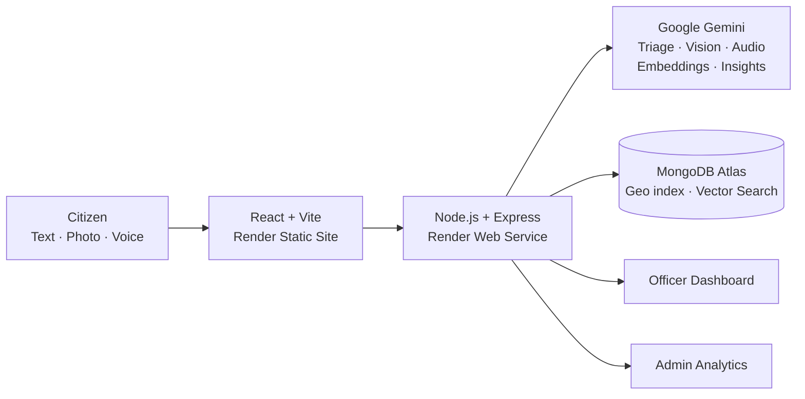

<div align="center">

# 🏛️ CivicPulse

### Every complaint. The right desk. In seconds.

AI-powered complaint triage for civic bodies, built for **HN-AI-02 · Smart Complaint Triage for Civic Bodies**


**[🔗 Live Demo](YOUR_RENDER_URL)**

</div>

---

## 📌 Problem

Civic bodies receive thousands of complaints a day, mostly sorted by hand. Urgent issues wait in the same queue as minor ones, the same problem gets reported many times, and citizens must guess the right department.

## 💡 Solution

Citizens complain naturally, in English, Tamil or a mix of both, using text, a photo or a voice note. **Google Gemini** detects the language, translates it, picks the category and department, assigns a priority from 1 to 5 **with a reason**, flags spam and sets an SLA. **MongoDB Atlas Vector Search** with geo-proximity merges duplicate reports into one issue, so officers get a clean, prioritised queue.

## ✨ Features

- 🌐 **Multilingual intake** with an EN / தமிழ் interface toggle
- 📸 **Photo and voice** understanding with Gemini
- 🧠 **Explainable AI triage**: category, department and priority, each with a reason
- 🔗 **Duplicate merging** across languages (semantic similarity plus a 300 m radius)
- 📈 **Auto-escalation** when 5 or more citizens report the same issue
- ⏱️ **SLA tracking** with past-deadline alerts
- 🧑‍💼 **Human in the loop**: officers can override the AI, with a logged reason
- 📊 **Admin analytics**, hotspot map and **AI weekly insights**
- 📍 **Citizen tracking** with a status timeline

## 🏗️ Architecture



**Complaint flow:** Submit → Gemini triage → spam check → embedding → duplicate check (merge or create issue) → department queue with SLA → citizen tracks status.

## 🛠️ Tech Stack

| Layer | Technology |
|---|---|
| AI | Google Gemini |
| Database | MongoDB Atlas (Mongoose, 2dsphere, Vector Search) |
| Backend | Node.js, Express, TypeScript, JWT |
| Frontend | React, Vite, TypeScript, Tailwind CSS, shadcn/ui, Leaflet, Recharts |
| Hosting | Render |

## 🚀 Getting Started

```bash
git clone https://github.com/YOUR_USERNAME/civicpulse.git
cd civicpulse
npm install
npm run dev:demo   # instant demo with an in-memory database, no keys needed
```
Open **http://localhost:5173**.

**With your own database and Gemini**, create `server/.env`:
```env
MONGODB_URI=your_mongodb_atlas_uri
GEMINI_API_KEY=your_gemini_api_key
JWT_SECRET=any_long_random_string
```
```bash
npm run seed   # load demo data (wipes the database)
npm run dev
```

**Demo logins:** `admin@civicpulse.in` / `Admin@123` · `roads@civicpulse.in` / `Officer@123` (other departments use the same password)

## ☁️ Deploy on Render

1. On Render, choose **New → Blueprint** and select this repo (`render.yaml` sets up both services).
2. Set `MONGODB_URI`, `GEMINI_API_KEY`, `JWT_SECRET` and `CLIENT_ORIGIN` on the API, and `VITE_API_BASE_URL` on the web app.
3. In MongoDB Atlas, allow network access from `0.0.0.0/0`.

## 🔒 Responsible AI

Every AI decision shows its reasoning, officers can override it, complaints are never lost if the AI fails, phone numbers are masked, and officers only see their own department.

## 🔮 Future Scope

WhatsApp complaint bot · predictive hotspots · integration with existing grievance portals · more languages

## 👥 Team [TEAM NAME]

[Name] · [Name] · [Name]

---

<div align="center">

*Hackathon prototype, not an official government website.*

</div>
